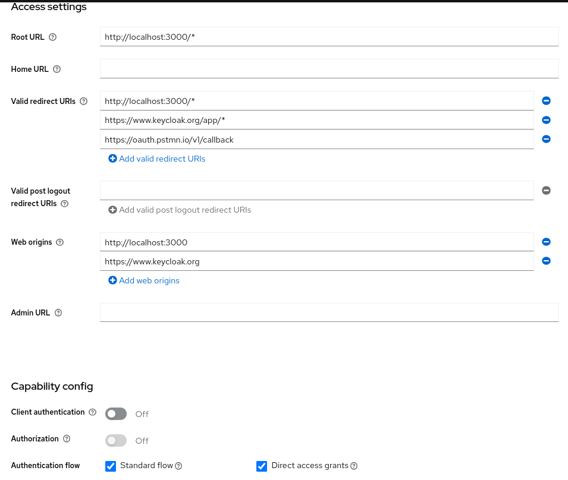
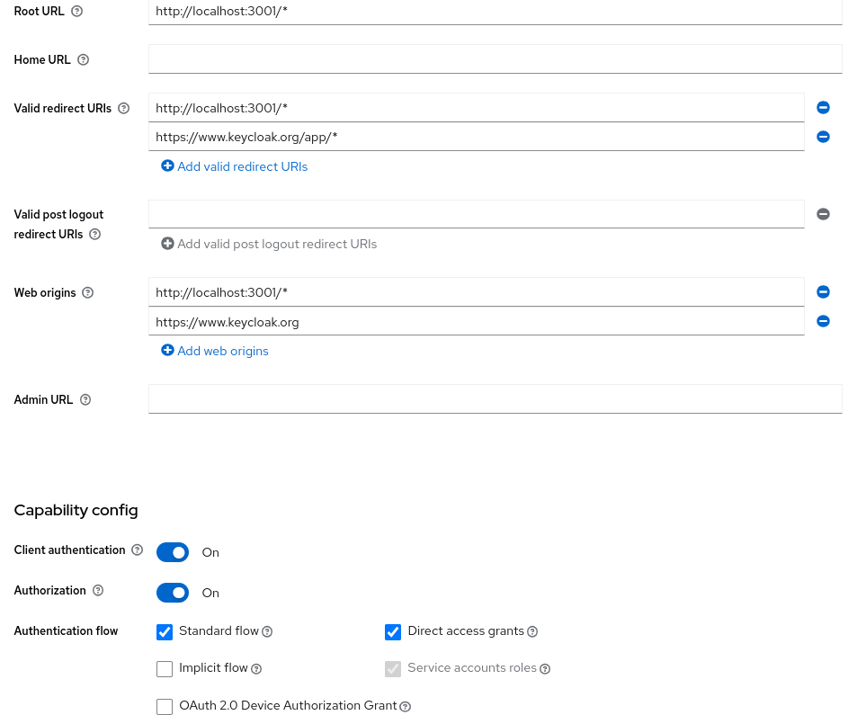

# Jak włączyć aplikację

## Keycloak

`docker run -p 8080:8080 -e KEYCLOAK_ADMIN=admin -e KEYCLOAK_ADMIN_PASSWORD=admin quay.io/keycloak/keycloak:21.1.1 start-dev`

Trzeba stworzyć realm o nazwie `myrealm` oraz klientów o nazwie `myclient` dla frontendu oraz `myapiclient` dla backendu.

config `myclient`

config `myapiclient`

## MongoDB

Trzeba mieć działającą bazę danych MongoDB, ja miałem ją włączoną natywnie na komputerze.

## frontend

Będąc w katalogu `client` wpisać komendę `yarn install`, a później `yarn dev` w celu włączenia aplikacji

## backend

Będąc w katalogu `server` wpisać komendę `yarn install`, a później `yarn start` w celu włączenia aplikacji
Stworzyć plik .env w którym ustawić `MAPBOX_TOKEN`, który można wygenerować w serwisie `mapbox`
